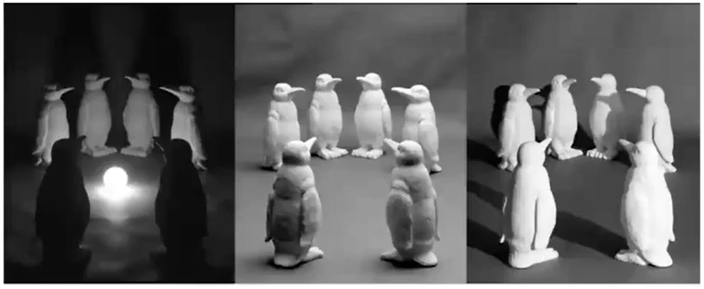
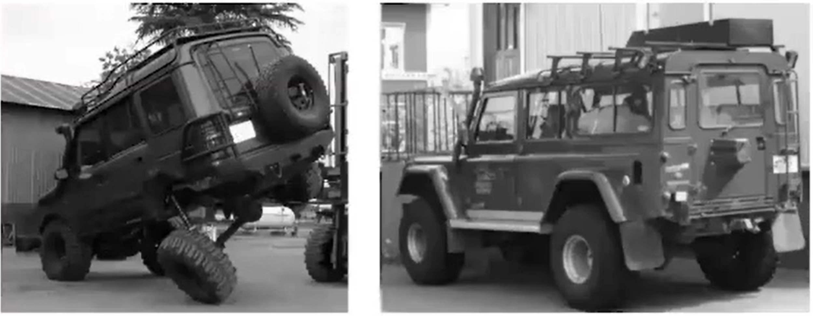
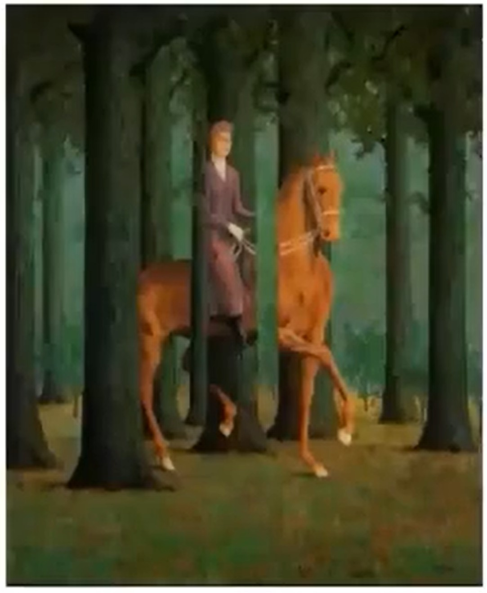

# AI算法基本功、AI算法进阶技能和OpenCV模块分析

项目背景 学习redis源码中布隆过滤器时, 发现redis中建立伯努利数学模型来统计pfcount的次数。因此创建该项目学习人工智能的一些知识的记录。

# 一、 AI算法基本功

## 1、 数学基础

### ①、 高等数学

|模块|类型|链接|
|:--:|:--:|:--:|
|高等数学|数学知识|[1.导数](https://github.com/chensongpoixs/cartificial_intelligence/blob/master/mathematics/1.%E5%AF%BC%E6%95%B0.ipynb "1.导数")|
|高等数学|数学知识|[2.向量的概念](https://github.com/chensongpoixs/cartificial_intelligence/blob/master/mathematics/2.%E5%90%91%E9%87%8F%E7%9A%84%E6%A6%82%E5%BF%B5.ipynb "2.向量的概念")|
|高等数学|数学知识|[3.矩阵](https://github.com/chensongpoixs/cartificial_intelligence/blob/master/mathematics/3.%E7%9F%A9%E9%98%B5.ipynb "3.矩阵")|
|高等数学|数学知识|[4.偏导数](https://github.com/chensongpoixs/cartificial_intelligence/blob/master/mathematics/4.%E5%81%8F%E5%AF%BC%E6%95%B0.ipynb "4.偏导数")|

### ②、 线性代数

### ③、 概率论与数理统计

[概率论与数理统计](https://chensongpoixs.github.io/cartificial_intelligence/mathematics/%E6%A6%82%E7%8E%87%E8%AE%BA%E4%B8%8E%E6%95%B0%E7%90%86%E7%BB%9F%E8%AE%A1/ "概率论与数理统计")

### ④、微积分

### ⑤、最优化

### ⑥、信息论

## 2、 AI算法基础

### ①、机器学习 

|算法或者理论|用到的数学知识点|
|:--:|:--|
|贝叶斯分类器|随机变量, 贝叶斯公式, 随机变量独立性, 正态分布, 最大似然估计|
|决策树|概率, 熵, Gini系数|
|KNN算法|距离函数|
|主成分分析|协方差矩阵, 散布矩阵, 拉格朗日乘数法, 特征值与特征向量|
|流行学习|流行, 最优化, 测地线, 测地距离, 图, 特征值与特征向量|
|线性判别分析|散度矩阵, 逆矩阵, 拉格朗日乘法数, 特征值与特征向量|
|支持向量机|点到平面的距离, Slater条件, 强对偶, 拉格朗日对偶, KKT条件, 凸优化, 核函数, Mercer条件|
|logistic回归|概率, 随机变量, 最大似然估计, 梯度下降法, 凸优化, 牛顿法|
|随机树林|抽样, 方差|
|AdaBoost算法|概率, 随机变量, 极值定理, 数学期望, 牛顿法|
|隐马尔可夫模型|概率, 离散型随机变量, 条件概率, 随机变量独立性, 拉格朗日乘数法, 最大似然估计|
|条件随机场|条件概率, 数学期望, 最大似然估计|
|高斯混合模型|正态分布, 最大似然估计, Jensen不等式|
|人工神经网络|梯度下降法, 链式法则|
|卷积神经网络|梯度下降法, 链式法则|
|循环神经网络|梯度下降法, 链式法则|
|生成对抗网络|梯度下降法, 链式法则, 极值定理, Kullback-Leibler散度, 测地距离, 条件分布, 互信息|
|K-means算法|距离函数|
|强化学习|数学期望, 贝尔曼方程|
|贝叶斯网络|条件概率, 贝叶斯公式, 图|
|VC维|Hoeffding不等式|

### ②、深度学习

## 3、 细分领域基础 

### [①、计算机视觉](computer_vision)

### ②、语言处理

### ③、搜索系统

### ④、推荐系统

### ⑤、计算广告

### ⑥、数据挖掘

# 二、AI算法进阶技能

## 1、 数学进阶 

### ①、随机过程

### ②、 矩阵论

### ③、泛函分析

### ④、微分几何

### ⑤、动力系统

## 2、计算机进阶

分布式离线计算， 分别是流式计算 ...

## 3、 AI 算法进阶 

### ①、数据挖掘（因果推断）

### ②、计算机视觉SLAM

### ③、自然语言处理（多人对话）

....

## 4、研究挑战

### ① 视觉变化、角度不同

### ② 关照变化

### ③ 尺度变化

### ④ 形态变化

### ⑤ 背景混淆干

### ⑥ 遮挡

### ⑦ 类内物体的外观差异

# 三、OpenCV模块分析

OpenCV模块功能介绍

|序号|模块|介绍|重要性|
|:---:|:---:|:---:|:---:|
|1.| calib3d模块       |   相机效果和3D相关内容相关| |
|2.| core模块            | 记录OpenCV的基础数据类型、矩阵操作、绘图操作 等等几乎OpenCV所有基础模块都在这里|必须掌握的的| 
|3.| dnn模块             | 神经网络相关| |
|4.| featrues2d模块      | 图像一些角点检查相关的（图像匹配）| |
|5.| flann模块           | 一些聚类相关的（林遇搜索）| |
|6.| highgui模块         | 图形相关交换的(比较重要基础)| |
|7.| imgcodecs和imgproc  | 图像相关的处理（图像的各种滤波器、图像的直方图统计、图像的均衡化、图像的集合变换、图像的颜色处理等等）| |
|8.| ml模块              | 机器学习【神经网络】 | 非常重要|
|9.| objetect模块                | 物体检查模块| |
|10.| proto模块                  | 图片处理（图片修复、 图片去噪）|非常重要 | 
|11.| shape模块                  | | |
|12.| stitching模块              | 大图像的拼接模块（360全景相机）| |
|13.| video、videoio和videostab模块 |视频信息（视频分解信息、图片合并视频）| |

# 四、目标检试常用算法

## 1. SSD系列算法

基本流程

Default box

Prior box

样本构造

数据增强

损失函数

SSD变种

网络性能对比

实验结果分析

不同算法优缺点

应用场景

 
 

 
 
 

## 2. Yolo系列算法

基本流程

主干网络结构

设计思路

Yolov1/v2/9000/v3

Anchor Boxes

Multi-Scale Training

Darknet

不同算法优缺点

网络性能对比

实验结果分析

## 3. Faster RCNN系列算法

基本流程

RCNN/Faster RCNN

Faster RCNN变种

主干网络设计思想

RPN原理

OHEM、NMS

Soft-NMS

实验结果分析

不同算法优缺点

应用场景

## 4. 文本检试系列算法

传统文本检测方法

物体检测VS文本检测

文本检测常见问题

文本检测应用场景

文本检测标注方式

文本检测算法优化方向

常用算法模型

CTPN/EAST/textboxes

文本检测数据集介绍

不同数据集比较

## 5. 多任务系列算法

原理分析

网络结构

泛化性分析

学习机制

使用场景

脸部特征点检测：TCDCN

人脸识别：DeepID2

物体检测与分类

旋转人脸网络

文本检测与识别

多任务网络训练技巧

实战多种场景

