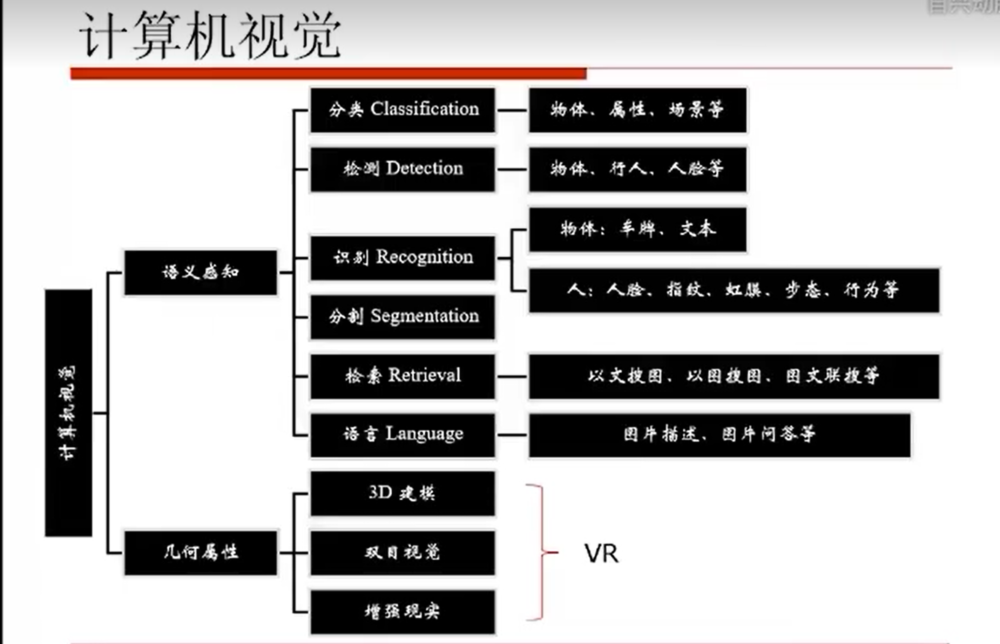

# 计算机视觉



## 一、计算机视觉的基础

[1. 图像预处理](一、fundamentals_computer_vision/1.image_preprocessing.md)

[2. 图像特征及描述](一、fundamentals_computer_vision/2.image_features_descriptions.md)

[3. 未有深度学习之前](一、fundamentals_computer_vision/3.before_deep_learning.md)


## 二、深度学习的理论基础

[1. BP神经网络详解](二、theoretical_basis_deep_learning/1.fundamentals_nural_networks_deep_learning.md)

[2. 深度学习基础]()

## 三、深度学习在计算机视觉中的应用

1. 图像分类 ---> 卷积神经网络CNN
2. 图像检测 ---> 区域卷积神经网络R-CNN
3. 图像分割 ---> 区卷积神经网络FCN
4. 图像描述 ---> 迭代神经网络RNN
5. 图像生成 ---> 生成对抗网络GAN

[](computer_vision/三、application_deep_learning_computer_vision/1.convolutional_neural_network.md)

# 开源库介绍

## 一、OpenCV
``` 
函数库:计算机视觉，机器学习
优化算法:2500+
编程语言:C,C++,Java,Python， Matlab
系统: Windows,Linus,Mac OS,iOS,Android
并行计算:CUDA,OpenCL
URL:http://opencv.org
```

## 二、Caffe

```
函数库: 深度学习
发布方: Berkeley Vision and Learning Center(BVLC)
编程语言:C++,Python
并行计算:CUDA
URL:http://caffe.berkeleyvision.org
特色:
- 在配置中定义模型并优化，不需要硬编码
- 代码的可扩展性强
- 运行速度非常快

```

## 三、Torch(PyTorch)

```
函数库: 深度学习
发布方:Facebook
编程语言:Lua(Python)
并行计算:CUDA
URL: https://torch.ch(http://pytorch.org/)
特色:
- 使用动态计算图，提供了更快速的方法
- 提供了运行在 GPU/CPU之上、基础的张量操作库:
- 支持共享内存的多进程并发 (multiprocessing)库

```

## 四、Tensorflow

有一个版本多个gpu的优化

``` 
函数库: 深度学习
发布方:Google
编程语言:Python
并行计算:CUDA
URL:https://www.tensorflow.org/
特色: 多机、多GPU分布式

适用于超大模型，超大数据集Tensorboard将训练过程可视化
```
